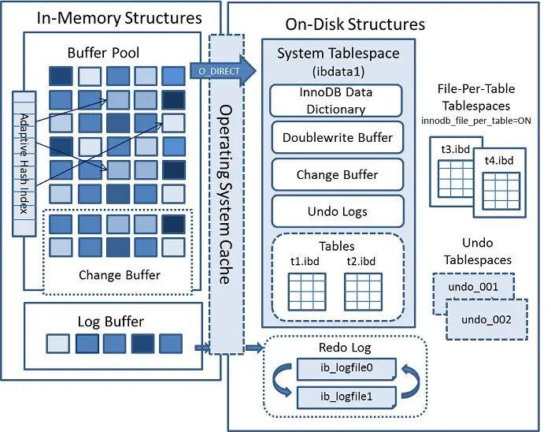

# MySQL

[TOC]

## Logical Architecture


1. **Client Applications**: These are the applications or tools that interact with the MySQL server to request and manipulate data. Examples include web applications, desktop applications, and command-line tools.
2. **SQL Interface**: The Structured Query Language (SQL) interface is the primary means of communicating with the MySQL server. Client applications send SQL queries and statements to the server to request data retrieval, insertion, updating, and deletion.
3. **Parser**: The parser component of MySQL's architecture interprets the SQL queries sent by client applications. It checks the syntax and semantics of the queries and converts them into an internal representation that the server can understand.
4. **Query Optimizer**: After parsing the query, the query optimizer determines the most efficient way to execute the query. It analyzes various query execution plans and chooses the one that minimizes resource usage and processing time. 最主要的目标是 尽可能地使用索引，并且使用最严格的索引来消除尽可能多的数据行。
   - 选择最合适的索引；
   - 选择表扫还是走索引；
   - 选择表关联顺序；
   - 优化 where 子句；
   - 排除管理中无用表；
   - 决定 order by 和 group by 是否走索引；
   - 尝试使用 inner join 替换 outer join；
   - 简化子查询，决定结果缓存；
   - 合并试图；
5. **Cache and Buffer Management**: MySQL uses various caches and buffers to optimize data retrieval and manipulation. The query cache stores the results of frequently executed queries, while the buffer pool holds frequently used data pages in memory to reduce disk I/O.
6. **Storage Engines**: MySQL supports different storage engines, each with its own way of storing and managing data. The two most common storage engines are InnoDB (transactional) and MyISAM (non-transactional). The choice of storage engine impacts data integrity, concurrency, and performance.
   - InnoDB
   - myISAM
   - Memory


## Grammar

### Processing Databases

- **CREATE DATABASE** - Create a new database

  ```sql
  CREATE DATABASE database_name;
  ```

- **USE** - Select a database to work with

  ```sql
  USE database_name
  ```

- **ALTER DATABASE** - Modify properties of a database

  ```sql
  ALTER DATABASE database_name
  CHARACTER SET = new_charset;
  ```

- **DROP DATABASE** - Delete a database and its contents

  ```sql
  DROP DATABASE database_name;
  ```

### Processing Tables
* **CREATE TABLE** - Create a new table

  ```sql
  CREATE TABLE table_name (
      column1 datatype,
      column2 datatype,
      ...
  );
  ```

* **ALTER TABLE** - Modify an existing table's structure:

  ```sql
  ALTER TABLE table_name
  ADD column_name datatype;
  ```

* **DROP TABLE** - Delete a table and its data:

  ```sql
  DROP TABLE table_name;
  ```
  
### Processing Data in Table
* **INSERT** - Insert data into a table

  ```sql
  INSERT INTO table_name (column1, column2) VALUES (value1, value2);
  ```

* **SELECT** - Retrieve data from one or more tables

  ```sql
  SELECT column1, column2 FROM table_name WHERE condition;
  ```

  * **SELECT DISTINCT** - is used to retrieve unique values from a column or combination of columns in a result set.

    ```sql
    SELECT DISTINCT column_name FROM table_name;
    ```

  - **GROUB BY** - is used to group rows from a table based on one or more columns. It is often used in combination with aggregate functions like `COUNT`, `SUM`, etc.

    **HAVING** - is used to filter the results of a `GROUP BY` query based on aggregate function results.

    ```sql
    SELECT department, AVG(salary) FROM employees GROUP BY department HAVING AVG(salary) > 50000;
    ```


  - **ORDER BY** - is used to sort the result set based on one or more columns. It can sort in ascending (default) or descending order using `ASC` or `DESC` respectively.

    ```sql
    SELECT * FROM products ORDER BY price DESC;
    ```

* **UPDATE** - Modify existing data in a table

  ```sql
  UPDATE table_name SET column1 = value1, column2 = value2 WHERE condition;
  ```

* **DELETE** - Remove rows from a table

  ```sql
  DELETE FROM table_name WHERE condition;
  ```


- **WHERE** - is used to filter rows from a table based on a specified condition, works before returning the result set.

  ```sql
  SELECT * FROM customers WHERE age > 25;
  ```

- **JOIN** - is used to combine rows from two or more tables based on a related column between them

  

  - **INNER JOIN**: Returns only the rows where there is a match in both tables.
  - **LEFT JOIN (or LEFT OUTER JOIN)**: Returns all the rows from the left table and matching rows from the right table.
  - **RIGHT JOIN (or RIGHT OUTER JOIN)**: Returns all the rows from the right table and matching rows from the left table.
  - **FULL JOIN (or FULL OUTER JOIN)**: Returns all rows from both tables, including unmatched rows.
  - **CROSS JOIN**: Produces a Cartesian product of rows from both tables (all possible combinations).

### Processing Indexs
- **CREATE INDEX** \- Create an index on one or more columns

  ```sql
  CREATE INDEX index_name ON table_name (column1, column2);
  ```

  - **CREATE UNIQUE INDEX**

- **SHOW INDEXES** - Viewing Index Information for a Table

  ```sql
  SHOW INDEXES FROM your_table;
  ```

- **DROP INDEX** \- Remove an index from a table

  ```sql
  DROP INDEX index_name ON table_name;
  ```

### Pattern Matching

* **BETWEEN ... AND ...** - Used to filter values within a range.

  ```sql
  SELECT column_name FROM table_name WHERE column_name BETWEEN value1 AND value2;
  ```

* **LIKE** - SELECT column_name FROM table_name WHERE column_name LIKE 'pattern';

  ```sql
  SELECT column_name FROM table_name WHERE column_name LIKE 'pattern';
  ```

* **IN (...)** - Used to match a value against a list of values.

  ```sql
  SELECT column_name FROM table_name WHERE column_name IN (value1, value2, value3);
  ```


### Functions

* **REPLACE** - Used to replace occurrences of a substring within a string.

  ```sql
  UPDATE table_name SET column_name = REPLACE(column_name, 'old_string', 'new_string');
  ```

* **TO_DATE / STR_TO_DATE** - Functions to convert strings to date values.

  ```sql
  SELECT STR_TO_DATE('2023-08-16', '%Y-%m-%d') AS formatted_date;
  ```

* CURRENT_TIMESTAMP - Returns the current date and time.

* **UNION / EXCEPT / INTERSECT** - Used to combine or compare results from multiple queries.

  

  ```sql
  SELECT column_name FROM table1
  UNION
  SELECT column_name FROM table2;
  ```

* **COUNT** - Returns the number of rows that match a specified condition.

  ```sql
  SELECT COUNT(*) AS row_count FROM table_name WHERE condition;
  ```

* **SUM** - Calculates the sum of numeric values in a column.

  ```sql
  SELECT SUM(column_name) AS total_sum FROM table_name;
  ```

* **AVG** - Calculates the average of numeric values in a column.

  ```sql
  SELECT AVG(column_name) AS average_value FROM table_name;
  ```

* **MIN / MAX** - Returns the minimum or maximum value from a column.

  ```sql
  SELECT MIN(column_name) AS min_value, MAX(column_name) AS max_value FROM table_name;
  ```


### Monitoring


* **EXPALIN** - is used to provide information about how a particular SQL query will be executed by the database engine.

  ```sql
  EXPLAIN SELECT column1, column2 FROM table1 WHERE condition;
  ```

## InnoDB

### Architecture



#### Buffer Pool


**Purpose**

- reading data: if the data exists in the Buffer Pool, the client will directly read the data in the Buffer Pool, otherwise it will be read from the disk.

- modifying data: the first step is to modify the page where the data is located in the Buffer Pool, then set its page as dirty, and finally write the dirty page to disk by the backend thread.

  The following situations can trigger the flush of dirty pages to the disk:

  - redo log is full
  - When the buffer pool space is insufficient, a portion of the data pages need to be eliminated. If dirty pages are eliminated, they need to be synchronized to the disk first;
  - MySQL is idle, background threads will periodically flush an appropriate amount of dirty pages onto the disk;
  - Before MySQL shuts down normally, all dirty pages will be flushed to the disk

#### Architecture

- **Free linked list**: 管理空闲页
- **Flush linked list**: 管理脏页
- **LRU linked list**: 提高命中率


**Free & Flush linked list**


**Improved LRU linked list**


- 预读失效: young + old (2 : 1)

  - 所以，MySQL 在加载数据页时，会提前把它相邻的数据页一并加载进来，目的是为了减少磁盘 IO。

    但是可能这些被提前加载进来的数据页，并没有被访问，相当于这个预读是白做了，这个就是预读失效。

    如果使用简单的 LRU 算法，就会把预读页放到 LRU 链表头部，而当 Buffer Pool空间不够的时候，还需要把末尾的页淘汰掉。

    如果这些预读页如果一直不会被访问到，就会出现一个很奇怪的问题，不会被访问的预读页却占用了 LRU 链表前排的位置，而末尾淘汰的页，可能是频繁访问的页，这样就大大降低了缓存命中率。

- Buffer Pool 污染

  - 当某一个 SQL 语句扫描了大量的数据时，在 Buffer Pool 空间比较有限的情况下，可能会将 Buffer Pool 里的所有页都替换出去，导致大量热数据被淘汰了，等这些热数据又被再次访问的时候，由于缓存未命中，就会产生大量的磁盘 IO，MySQL 性能就会急剧下降，这个过程被称为 Buffer Pool 污染。
  - 如果后续的访问时间与第一次访问的时间在某个时间间隔内，那么该缓存页就不会被从 old 区域移动到 young 区域的头部
  - 如果后续的访问时间与第一次访问的时间不在某个时间间隔内，那么该缓存页移动到 young 区域的头部；

#### Log

- undo log（回滚日志）：是 Innodb 存储引擎层生成的日志，实现了事务中的原子性，主要用于事务回滚和 MVCC。
- redo log（重做日志）：是 Innodb 存储引擎层生成的日志，实现了事务中的持久性，主要用于掉电等故障恢复；
- binlog （归档日志）：是 Server 层生成的日志，主要用于数据备份和主从复制；


- redo log 记录了此次事务「**完成后**」的数据状态，记录的是更新**之后**的值；
- undo log 记录了此次事务「**开始前**」的数据状态，记录的是更新**之前**的值；

## Application

## Other

### Master-Slave replication


#### Slow Query


## 快照读 vs. 当前读

