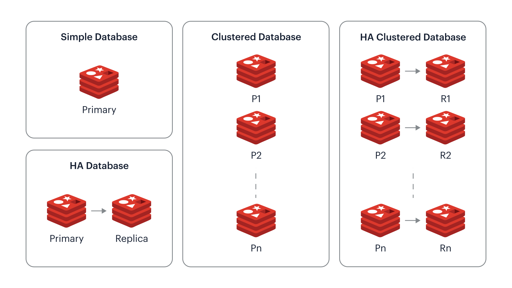

# Redis

[TOC]

## Data Structure

- String
- Hash
- List
- Set
- Sorted Set

### String: Simple dynamic string

```c
struct sdshdr {
    int len;
    int free;  // the number of unused bytes in the buf array
    char buf[];
}
```


***Q: Simple dynamic string vs. string in C?***

- Constand complexity to obtain string length.
- Prevent buffer overflew.
- Reduce the number of memory reallocations caused by modifying strings.
- Binary security.

### List: Double link list

```c
struct listNode {
    listNode *prev;
    listNode *next;
    void *value;
};

struct list {
    listNode *head;
    listNode *tail;
    unsigned long len;
};
```


#### API

- copy nodes
- release nodes
- comparison nodes

### Hash

$$
f: key \to value
$$

#### Structure

- sizemark: The hash table size mask is used to calculate that the index, and value is always equal to size-1
- used: The number of existing nodes in this hash table

```cpp
struct dict {
    dictType *type;  // Type specific function
    void *privdata;
    dictht ht[2];  // Hash table
    int rehashidx;  // rehash index, When rehash is not in progress, the value is -1
}

struct dictht {
    dictEntry **table;
    unsigned long size;
    unsigned long sizemark;
    unsigned long used;
}

struct dictEntry {
	void *key;  // key
	union {
		void *val;
		uint64_tu64;
		int64_ts64;
	} v;  // value
	struct dictEntry *next;  // Pointer to the next hash table node to form a linked list
}
```


#### API

- calculating hash values
- copying keys & values
- comparison key
- Destroying Keys & Values

#### Hash algorithm: MurmurHash2

MurmurHash2 is a non-cryptographic hash function created by Austin Appleby in 2008. The MurmurHash2 algorithm operates on 32-bit integers, mixing the input data in a way that produces a pseudorandom distribution of hash values.

- Initialize a hash value with a seed.
- Process input data in 32-bit chunks.
- Mix each chunk with the hash value using a series of bitwise operations, multiplications, and mixing constants.
- Finalize the hash value, ensuring a good distribution of bits.

#### Collision: Separate chaining

Redis's hash table uses **separate chaining** to resolve key conflicts. Each hash table node has a next pointer, and multiple hash table nodes can use the next pointer to form a one-way linked list, which is assigned to the same Multiple nodes on an index can be connected using this one-way linked list, which solves the problem of key conflicts.


#### Rehash, Progressive Rehash

Rehashing refers to the process of redistributing data across the hash slots in the cluster when the number of hash slots changes due to adding or removing nodes. The purpose of Rehashing are Scaling and Load Balancing, Efficient Resource Utilization, Maintaining Performance, Adapting to Changing Workloads. Load Factor Calculation:

$$
\text{loadfactor} = \frac{ht[0].used}{ht[0].size}
$$

**Trigger Conditions**. Trigger expansion operation conditions, (1) The server is not currently executing a `BGSAVE` command or a `BGREWRITEAOF` command and $\text{loadfactor} \ge 1$. (2) The server is currently executing a `BGSAVE` command or a `BGREWRITEAOF` command and $\text{loadfactor} \ge 5$. (3) Trigger shrink operation conditions $\text{loadfactor} < 0.1$

**Process**

1. **Allocate space for the hash table $ht[1]$.** (1) If an extension operation, the size of ht [1] is the first $2^n$ that is greater than or equal to $ht[0].used \times 2$. (2) If a shrink operation, the size of ht [1] is the first $2^n$ that is greater than or equal to $ht[0].used$.
2. **Rehash**, refers to recalculating the hash and index values of the key, and then placing the key value pairs at the specified position in the $ht[1]$ hash table.
3. **Release $ht[0]$**. After all the key value pairs contained in ht [0] have been migrated to ht [1], release ht [0], set ht [1] to ht [0], and create a new empty hash table in ht [1] to prepare for the next rehash.

**Progressive Rehash**, this rehash action is not completed in a one-time, centralized manner, but in multiple, gradual stages. And the main difference between the hash process and the hash process is in the hash process in step 2, 

- Maintain an index counter variable ***rehashidx*** and set its value to 0, indicating the start of rehashing. During the rehash process, for every dictionary operation, in addition to rehash all key-value pairs from ht[0] at index rehashidx to ht[1]. Increment rehashidx after each operation. Finally, set rehashidx to -1 when rehashing is done.

### Sorted Set: Skip List


```cpp
struct zskiplistNode {
    // Level
    struct zskiplistLevel {
        struct zskiplistNode *forward;  // forward pointer
        unsigned int span;
    } level[];
    
    struct zskiplistNode *backward;  // backward pointer
    double score;
    robj *obj;
};

struct zskiplist {
    struct zskiplistNode *header，*tail;  // Header and footer nodes
    unsigned long length;
    int level;  // The number of layers of the node with the highest number of layers in the table
};
```


### Zip List


## Persistence

### RDB (Redis Database)

***Q: Can Redis handle write requests concurrently during RDB generation?  Copy On Write***

**Copy On Write**



### AOF (Append-Only File)

## Multi-machine database architecture

### Master-Slave


如何保证主从数据的一致性？

**Synchronization process**. (1) SYNC 命令, 标志主从同步的执行。 (2) RDB 作为同步数据载体。(3) 命令传播，缓存区记录接下来的写命令。然后发给从服务器。

- `PSYNC`
  - full resynchronization
  - partial resynchronization
    - replication offset
    - replication backlog: The copy backlog buffer is a fixed length (fixed-size) first in first out (FFO) queue maintained by the main server, with a default size of 1MB.
- command propagate

#### implement of Synchronization 

```SLAVEOF <master_ip> <master_port>```

- set the host and port of master

  ```cpp
  struct redisServer {
  	// ...
  	char *masterhost;
  	int   masterport;
  	// ...
  };
  ```

- build the socket connection

- send `PING` command

  

- authentication: sent ```AUTH``` command

  

- send port information

- synchronization

- command propagate

### Redis Sentinel


Sentinel is just a Redis server running in a special mode.

order list of Sentinel:

- `ping`
- `sentinel`
- `subscribe`
- `unsubscribe`
- `psubscribe`: 
- `pusubscribe`
- `info`: 

#### Start & initialize Sentinel 

1. initialize serves
2. Replace the code used by regular Redis servers with Sentinel specific code.
3. initialize Sentinel status
4. initialize Sentinel's monitoring master server list based on the given configuration file.
5. create the network connection to the master servers.

#### Normal process

- Obtain Master Server Information

  Sentinel will default to sending `INFO` commands to the monitored main server through a command connection every $10$ seconds, and obtain the current information of the main server by analyzing the `INFO` command response.

- Obtain information from the server

- Sending information to the master and slave servers

- Receive channel information from master and slave servers

#### Fault handling

1. Detect subjective offline status
2. Detect  objective offline status
3. When a main server is judged to be objectively offline, the various Sentinels monitoring the offline main server will negotiate to select a leader Sentinel, and the leader Sentinel will perform a failover operation on the offline main server.
4. Failover
   1. Select a new primary server
   2. Modifying the replication target from the server
   3. Change the old master server to a slave server


### Redis Cluster


#### Cluster establishment

节点连接建立：Cluseter Meet，ip + port 进行握手，加入所在集群

记录自己的状态：cluster Node， 创建时间、名字、标识、上下线、IP、端口号、连接节点所需的信息

#### Storage Allocation: Slots Assignment

**Slots**. The Redis cluster saves key value pairs in the database through sharding: the entire database of the cluster is divided into $16384$ slots, and each key in the database belongs to one of the $16384$ slots. A node can handle $0$ or a maximum of $16384$ slots.

When $16384$ slots in the database are processed by nodes, the cluster is in the online state `ok`. Conversely, if any slot in the database is not processed, the cluster is in the offline state `fail`.


There are a total of ***16384*** slots, with an anticipated 1000 instances designed.

Cluster Addslots 将多个槽指派给节点负责。这些信息记录在 Slots 位图上。Slots 信息会发给其他节点，其他节点会在自己对该节点的记录上更新信息。

- ClusterNode.slots
- ClusterState.slots


**Calculate which slot the key belongs to.** `slot = CRC16(Key) & 16383.` Keys are hashed to determine which slot they belong to. Redis Cluster uses hash slots to distribute keys across multiple Redis instances. The hash slot calculation is done using the **CRC16** algorithm.

#### Command execution

Find the responsible machine for the slot where the key value of the command is located.

#### Resharding

#### Replication & Failover

#### Gossip protocol

- MEET
- PING
- PONG


## Distributed Lock

### SETNX

- lock

  ```shell
  setx key test
  ```

  ```shell
  SET key value [EX seconds][PX milliseconds] [NX|XX]
  ```

- unlock

  ```shell
  del key
  ```

- lock timeout

  ```shell
  expire key 30
  ```


### RedLock 

「setNX+Lua脚本」实现分布式锁在集群模式下的缺陷，由于 Redis 的主从模式是异步的，所以可能会在数据同步过程中，master 主节点宕机，slave 从节点来不及数据同步就被选举为 master 主节点，从而导致数据丢失，大致过程如下：

1. 用户在 Redis 的 master 主节点上获取了锁；
2. master 主节点宕机了，存储锁的 key 还没有来得及同步到 slave 从节点上；
3. slave 从节点升级为 master 主节点；
4. 用户从新的 master 主节点获取到了对应同一个资源的锁，同把锁获取两次。

#### Process

假设有 5 个完全独立的 Redis Master 节点，他们分别运行在 5 台服务器中，可以保证他们不会同时宕机。

1. 获取当前 Unix 时间，以毫秒为单位。
2. 依次尝试从 N 个实例，使用相同的 key 和随机值获取锁。在步骤 2，当向 Redis 设置锁时，客户端应该设置一个网络连接和响应超时时间，这个超时时间应该小于锁的失效时间。例如你的锁自动失效时间为 10 秒，则超时时间应该在 5-50 毫秒之间。这样可以避免服务器端 Redis 已经挂掉的情况下，客户端还在死死地等待响应结果。如果服务器端没有在规定时间内响应，客户端应该尽快尝试另外一个 Redis 实例。
3. 客户端使用当前时间减去开始获取锁时间（步骤 1 记录的时间）就得到获取锁使用的时间。当且仅当从大多数（这里是 3 个节点）的 Redis 节点都取到锁，并且使用的时间小于锁失效时间时，锁才算获取成功。
4. 如果取到了锁，key 的真正有效时间等于有效时间减去获取锁所使用的时间（步骤 3 计算的结果）。
5. 如果因为某些原因，获取锁失败（没有在至少 N/2+1 个Redis实例取到锁或者取锁时间已经超过了有效时间），客户端应该在所有的 Redis 实例上进行解锁（即便某些 Redis 实例根本就没有加锁成功）。

到这，基本看出来，只要是大多数的 Redis 节点可以正常工作，就可以保证 Redlock 的正常工作。这样就可以解决前面单点 Redis 的情况下我们讨论的节点挂掉，由于异步通信，导致锁失效的问题。

